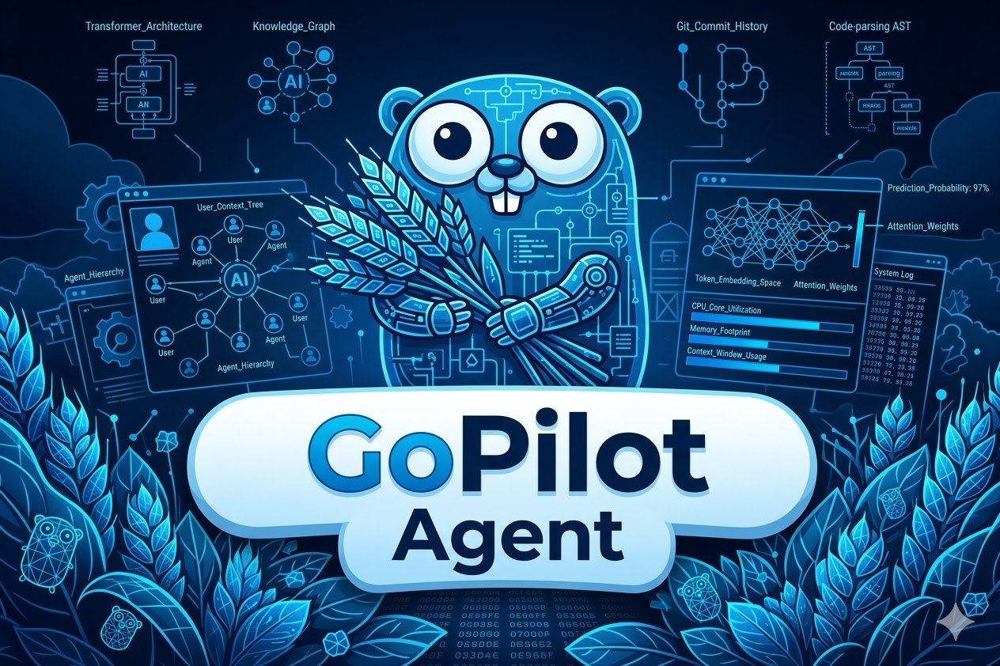

# GoPilot

A Qwen-like CLI assistant tool built in Go with a beautiful terminal UI and local AI inference.



## Features

- 🎨 Beautiful TUI (Text-based User Interface) using Bubble Tea
- 💬 Real-time streaming chat interface
- 🤖 Local AI inference using Kronk + Qwen models
- ⚡ Fast and responsive with streaming responses
- 🔌 Tool calling support (extensible)
- 🧠 Reasoning support

## Project Structure

```
gopilot/
├── cmd/
│   └── gopilot/       # Main application entry point
├── client/            # AI client (Kronk integration)
├── internal/
│   └── ui/            # UI components and styles
├── config/            # Configuration management
└── go.mod
```

## Building

```bash
go build -o gopilot ./cmd/gopilot
```

## Running

```bash
./gopilot
```

On first run, the application will:
1. Download the Qwen3-0.6B model (~500MB)
2. Initialize the inference engine
3. Start the chat interface

**Note:** First launch may take a few minutes while downloading the model.

## Controls

- **Enter**: Send message
- **Ctrl+C**: Quit

## Configuration

Edit `client/client.go` to customize:

- **Model**: Change `ModelSourceURL` or use `ModelID` for catalog models
- **System Prompt**: Modify the AI's behavior and personality
- **Max Tokens**: Adjust response length limits

### Example: Use a Different Model

```go
var modelSpecConfig = modelSpec{
    ModelID: "Qwen3-4B-Q8_0",  // Larger model from catalog
}
```

## Tech Stack

- [Bubble Tea](https://github.com/charmbracelet/bubbletea) - TUI framework
- [Lip Gloss](https://github.com/charmbracelet/lipgloss) - Styling
- [Bubbles](https://github.com/charmbracelet/bubbles) - UI components
- [Kronk](https://github.com/ardanlabs/kronk) - Local LLM inference
- [Qwen](https://huggingface.co/unsloth/Qwen3-0.6B-GGUF) - AI model

## Architecture

```
┌─────────────────┐
│   Main (cmd)    │
│  - Init Client  │
│  - Run Program  │
└────────┬────────┘
         │
    ┌────▼────┐
    │   UI    │
    │ (Bubble │
    │  Tea)   │
    └────┬────┘
         │
    ┌────▼────┐
    │ Client  │
    │ (Kronk) │
    └────┬────┘
         │
    ┌────▼────┐
    │  Qwen   │
    │  Model  │
    └─────────┘
```

## Next Steps

- [ ] Configuration file support (`~/.gopilot/config.yaml`)
- [ ] Conversation persistence
- [ ] Multiple model support
- [ ] Code syntax highlighting
- [ ] Tool/function calling UI
- [ ] Chat history management
- [ ] Custom themes

## Troubleshooting

### Model Download Fails
- Check your internet connection
- Ensure you have enough disk space (~1GB for model + libs)
- Try using a different model source

### Slow Responses
- Larger models provide better quality but are slower
- Close other CPU-intensive applications
- Consider using a smaller model

### Memory Issues
- The model requires ~2-4GB RAM
- Close other applications if experiencing issues
- Use a smaller quantized model

## License

MIT
